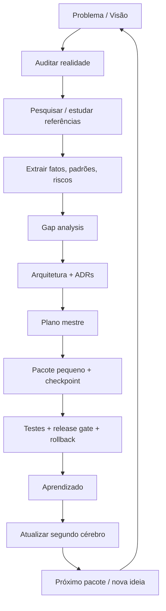

# DUTRA Builder Brain V2 — Skill + Segundo Cérebro

## Por que existe

A Builder Brain transforma o método que fez o DUTRA OS amadurecer em um protocolo reutilizável de produto + engenharia. Ela evita dois extremos: improvisação/feature creep e burocracia arquitetural para qualquer ajuste pequeno.

## A fórmula central



## Proporcionalidade: a V2 não obriga 11 etapas para tudo

### MICRO
Copy, CSS, ícone, mensagem, correção local e de baixo risco.

Fluxo: **inspecionar → alterar → teste focado**.

Não precisa registrar ciclo no brain, a menos que surja aprendizado durável.

### STANDARD
Feature/workflow delimitado usando arquitetura já conhecida.

Fluxo: contexto → evidência/decisão → plano pequeno → implementação → teste → closeout do brain.

### STRUCTURAL
Banco, fonte de verdade, entidade canônica, auth, sync, migration, integração externa, AI writes, workers, deploy ou mudança cross-module.

Usa o loop completo desde o primeiro estágio ainda não resolvido.

## Quando NÃO usar a Builder Brain completa

- correções visuais triviais;
- pergunta factual sem consequência de produto/arquitetura;
- explicação de código sem mudança;
- teste rotineiro já previsto;
- bug minúsculo com causa/rollback/teste óbvios;
- brainstorm que o usuário explicitamente quer manter efêmero.

Se uma tarefa pequena revelar dúvida estrutural, ela sobe de classe.

## Por que o DeskcommCRM foi importante

Deskcomm não virou “a arquitetura do DUTRA”. Ele foi uma referência externa de alta densidade.

O método foi: auditar DUTRA → estudar Deskcomm → extrair padrões/limitações → gap → arquitetura própria. Esse protocolo agora vale para qualquer CRM, repo, artigo, pesquisa, vídeo, benchmark ou produto externo.

## Segundo cérebro V2

JSONL continua sendo o formato canônico porque é simples, versionável e fácil de validar. Mas humanos não precisam navegar JSONL cru.

A V2 gera:

- `docs/second-brain/BRAIN_INDEX.md`
- `docs/second-brain/BRAIN_METRICS.md`

Rode:

```bash
npm run og:brain:refresh
```

Isso gera índice, gera métricas e executa validação semântica/referencial.

## Relações entre conhecimento

Todo registro durável usa explicitamente:

- `source_ids` — evidência;
- `derived_from` — de quais entradas aquela conclusão surgiu;
- `supersedes` — qual conclusão antiga foi substituída.

Exemplo:

```text
SOURCE: CRM externo
   ↓
PATTERN: timeline canônica
   ↓
IDEA: filtros rápidos
   ↓
EXPERIMENT
   ↓
DECISION
   ↓
PACKAGE / CYCLE
   ↓
LEARNING
```

Assim uma decisão futura pode ser rastreada até a pesquisa que a provocou.

## Schemas mínimos

O checker não valida apenas JSON agora. Ele exige campos comuns, campos específicos por tipo, status/confidence válidos, relações apontando para IDs existentes e índice/métricas atualizados.

Exemplos reais de cada tipo estão em:

```text
.codex/skills/dutra-builder-brain/examples/brain-records.md
```

## Métricas de sucesso

A skill passa a medir se está sendo realmente usada:

- taxa de consulta do brain antes de ciclos Standard/Structural;
- taxa de atualização ao final;
- ideias descartadas/adiadas antes de virar código;
- decisões superseded/revertidas;
- experimentos completados;
- perguntas abertas resolvidas;
- tempo mediano dos ciclos rastreados;
- releases corretamente bloqueadas por gates.

Não são metas para “bater”. São sinais diagnósticos. Uma ideia descartada antes de código pode representar economia.

## Adoção sustentada

Para Standard/Structural, o ciclo só fecha quando:

1. consultamos contexto relevante;
2. capturamos o aprendizado durável;
3. registramos o cycle;
4. rodamos `npm run og:brain:refresh`.

A cada 5 ciclos rastreados, revisar as métricas. Se o método estiver pesado, reduzir cerimônia antes de adicionar mais documentação.

## Licença e reutilização

Aprender padrão ≠ copiar código.

Quando houver possível code reuse, a skill agora consulta `reference/08-license-and-reuse.md` e classifica a licença/reuso. MIT/BSD/Apache, copyleft fraco, GPL/AGPL, source-available/custom e ausência de licença recebem tratamentos diferentes. Em dúvida material, marcar **LEGAL REVIEW**, não adivinhar.

## Ideação profissional

Uma ideia séria responde: problema, evidência, usuário/fluxo, entidade/dados, dependências, menor teste, risco e non-goals. Ideia empolgante sem evidência não ganha escopo automaticamente.

## Relação com outros agentes

A Builder Brain não substitui architect/dev/QA/data/UX. Ela escolhe estágio, evidência e contexto; o especialista executa; o resultado volta para o brain.

## Comandos

```bash
npm run og:brain:index
npm run og:brain:metrics
npm run og:brain:check
npm run og:brain:refresh
```

## Estado atual

A V2 nasce com o caso DUTRA OS já semeado, incluindo auditoria, Deskcomm, gap, Architecture V1, Master Plan, Package 01 e a própria revisão crítica que levou a esta V2.
