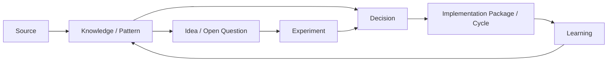

# DUTRA Builder Brain — Human Index

Generated from 37 records. Do not edit by hand; run `npm run og:brain:refresh`.

## Collections

| Type | Records |
|---|---:|
| anti_pattern | 3 |
| cycle | 3 |
| decision | 6 |
| experiment | 1 |
| idea | 3 |
| knowledge | 3 |
| open_question | 2 |
| pattern | 8 |
| source | 8 |

## Active decisions

- **DEC-ARCH-001 — Evolve DUTRA OS instead of full rewrite** (active/high)
  Preserve current commercial frontend/intelligence and replace weak foundation incrementally.
- **DEC-ARCH-002 — Canonical relational truth with individual identity** (active/high)
  Architecture V1 selects Supabase Postgres as official commercial truth and Supabase Auth for individual PC/mobile identity, with Realtime deferred unless later evidence justifies it.
- **DEC-ARCH-003 — Keep vanilla JS frontend for V1** (active/high)
  No evidence currently justifies a React/Next rewrite; modularize incrementally when touched.
- **DEC-BRAIN-001 — Builder Brain V2 governance model** (active/high)
  Adopt proportional scope classes, semantic/referential validation, generated index/metrics, cycle closeout and license triage for Builder Brain.
- **DEC-SEC-00R-001 — Revision-authoritative synchronization baseline** (active/high)
  State writes require the current server revision; arbitrary force merge and client timestamp arbitration are not accepted by local or Cloudflare APIs.
- **DEC-XLSX-00R-001 — Isolate the legacy XLSX parser** (active/high)
  Remove vulnerable xlsx npm dependency and retain the vendored parser only inside a time- and size-bounded Web Worker until a compatible maintained replacement is validated.

## Open questions

- **OQ-ENV-001 — Reproducible supported runtime for release certification** (open/high)
  Package 01 implementation environment was Node 22/npm 10 while the supported contract targets Node 24/npm 11+, and clean dependency installation did not complete; release certification remains blocked until tested in the supported environment.
- **OQ-PKG02-001 — Package 02 operational auth bootstrap details** (open/medium)
  Exact bootstrap/session/organization-membership implementation details must be confirmed against the chosen Supabase project/environment before enabling auth paths.

## Candidate / planned ideas

- **IDEA-BRAIN-001 — Research intake center for external references** (candidate/high)
  Provide a structured intake that accepts repo/article/paper/competitor/conversation sources and produces source cards, patterns, ideas and open questions without automatically changing product scope.
- **IDEA-BRAIN-002 — Idea promotion by repeated evidence/friction** (candidate/high)
  Track recurrence and evidence so repeated real friction promotes an idea while speculative novelty remains backlog.
- **IDEA-PRODUCT-001 — Company 360 as canonical commercial context surface** (planned/high)
  As Company/Contact become canonical, expose a fast Company 360 view with decision-maker, next action, timeline and quick actions.

## Validated / active patterns

- **PAT-REF-001 — Reference systems are pattern mines, not blueprints** (validated/high)
  Reverse engineer an external system by problem/capability, extract transferable patterns and complexity, then run a gap analysis before architecture decisions.
- **PAT-DATA-001 — One entity, one identity, multiple views** (active/high)
  CRM, prospecting, map, agenda, reports and AI should operate on canonical entities rather than maintain parallel copies.
- **PAT-AI-001 — AI over structured truth** (active/high)
  AI should consume selective structured context and propose actions; important writes pass through controlled domain operations and review rather than treating AI as the database.
- **PAT-DELIVERY-001 — Strangler migration with reversible vertical slices** (active/high)
  Replace legacy behavior incrementally with adapters, reconciliation, feature flags and rollback windows instead of a big-bang rewrite.
- **PAT-DELIVERY-002 — Professional gates may block release** (validated/high)
  Environment or test limitations should block/label a release rather than be hidden or reported as success.
- **PAT-UX-001 — Foundation plus visible user value** (active/high)
  Whenever safe, infrastructure packages should unlock a perceptible workflow improvement; UX polish should evolve with domain migration rather than as an isolated redesign.
- **PAT-BRAIN-001 — Proportional ceremony by risk** (active/high)
  Use MICRO, STANDARD and STRUCTURAL paths so low-risk work stays fast while structural work receives evidence/architecture/safety discipline.
- **PAT-BRAIN-002 — Machine store + generated human index** (active/high)
  Keep JSONL canonical for versioning/parsing while generating a readable index and metrics for human retrieval/adoption.

## Recent sources

- **SRC-DUTRA-AUDIT-001 — DUTRA OS technical audit** (validated/high)
  Audit of the actual DUTRA OS code/data paths used to establish current-state risks and assets before architecture work.
- **SRC-DESKCOMM-REV-001 — DeskcommCRM reverse engineering** (validated/high)
  Open-source CRM studied as an engineering reference; patterns were extracted together with limitations and NOT CONFIRMED areas rather than copied wholesale.
- **SRC-GAP-001 — DUTRA OS × DeskcommCRM gap analysis** (validated/high)
  Capability-by-capability comparison used to separate useful patterns from unnecessary complexity.
- **SRC-ARCH-V1-001 — DUTRA OS Architecture V1** (active/high)
  Approved architectural direction: evolve incrementally, use canonical relational truth and individual identity while preserving differentiated commercial UX/intelligence.
- **SRC-PLAN-001 — DUTRA OS Master Implementation Plan** (active/high)
  Turns Architecture V1 into small reversible packages across Foundation and Commercial Product tracks.
- **SRC-PKG01-001 — Implementation Package 01 report** (implemented/high)
  Foundation Bootstrap & Safety Gate implementation report including tests, environment blockers, rollback and intentionally deferred behavior.
- **SRC-BRAIN-REVIEW-001 — DUTRA Builder Brain design review** (validated/high)
  Structured review identified adoption, semantic validation, proportionality, metrics, provenance, human indexing and license-triage improvements for Builder Brain.
- **SRC-PKG00R-001 — Package 00R reconciliation and release baseline** (implemented/high)
  Package 00R reconciled the GitHub baseline with advisory artifacts, contained XLSX risk, hardened local and Cloudflare state APIs, installed Builder Brain governance and established CI and release gates.

## Retrieval workflow

1. Start here.
2. Search by ID/tag in the relevant JSONL collection.
3. Follow `source_ids`, `derived_from`, and `supersedes` for provenance.
4. Load only the records needed for the task.

## Relationship model

