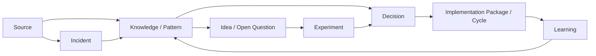

# DUTRA Builder Brain — Human Index

Generated from 165 records. Do not edit by hand; run `npm run og:brain:refresh`.

## Collections

| Type | Records |
|---|---:|
| anti_pattern | 17 |
| cycle | 22 |
| decision | 23 |
| experiment | 1 |
| idea | 3 |
| incident | 21 |
| knowledge | 13 |
| open_question | 7 |
| pattern | 23 |
| source | 35 |

## Active decisions

- **DEC-ARCH-001 — Evolve DUTRA OS instead of full rewrite** (active/high)
  Preserve current commercial frontend/intelligence and replace weak foundation incrementally.
- **DEC-ARCH-002 — Canonical relational truth with individual identity** (active/high)
  Architecture V1 selects Supabase Postgres as official commercial truth and Supabase Auth for individual PC/mobile identity, with Realtime deferred unless later evidence justifies it.
- **DEC-ARCH-003 — Keep vanilla JS frontend for V1** (active/high)
  No evidence currently justifies a React/Next rewrite; modularize incrementally when touched.
- **DEC-BRAIN-001 — Builder Brain V2 governance model** (active/high)
  Adopt proportional scope classes, semantic/referential validation, generated index/metrics, cycle closeout and license triage for Builder Brain.
- **DEC-SEC-00R-001 — Revision-authoritative synchronization baseline** (active/high)
  State writes require the current server revision; arbitrary force merge and client timestamp arbitration are not accepted by local or Cloudflare APIs.
- **DEC-XLSX-00R-001 — Isolate the legacy XLSX parser** (active/high)
  Remove vulnerable xlsx npm dependency and retain the vendored parser only inside a time- and size-bounded Web Worker until a compatible maintained replacement is validated.
- **DEC-SYNC-04R-001 — Human-reviewed revision conflicts with auth-safe outbox** (active/high)
  A revision conflict blocks automatic writes until a preserved local/remote comparison is reviewed; queued state persists without credentials and only an authenticated foreground session may perform the remote PUT.
- **DEC-MIG-05R-001 — Legacy reconciliation requires reviewed intent and reversible apply** (active/high)
  Legacy lead data may enter canonical Company/Contact only through dry-run classification, explicit user selection, checkpoint, revalidation against current state and controlled apply; weak/ambiguous matches never become canonical truth automatically.
- **DEC-HOST-06R-001 — HTTPS hosting is a protected preview, not a persistence architecture shortcut** (active/high)
  Expose the current DUTRA OS over HTTPS only through a protected hosted entrypoint with strong access token, healthcheck and persistent volume support; do not reinterpret the transition JSON state as the final canonical database or bypass the planned Supabase validation.
- **DEC-LEADS-OG18-001 — Keep conversation state, pipeline status and source as separate lead dimensions** (active/high)
  Smart lists are projections of one state.leads base. Conversation state, commercial pipeline status, source/list and priority remain independent fields; deterministic scoring may order work but never changes commercial truth automatically.
- **DEC-CIC01-001 — One deterministic score and shared commercial contracts** (active/high)
  All prioritization surfaces must delegate to the same deterministic score contract, and all next-action flows must use the same central mutation/normalization contracts instead of reimplementing weights, fallbacks or context rules per UI.
- **DEC-INTEL-COMPILER-001 — Extend Builder Brain as the DUTRA operational knowledge layer** (active/high)
  The existing Builder Brain remains the canonical durable evidence/decision layer; domain Skills stay thin and route to scoped context, stable domain guidance lives in existing knowledge/docs, dynamic account facts stay in CRM/runtime, and material bugs enter an incident collection with regression linkage.
- **DEC-V3-SHELL-001 — V3 is the single user experience during reintegration** (active/high)
  The V3 shell is the user-facing experience; legacy screens/engines may run internally during migration but must not require the seller to alternate between independent systems.
- **DEC-TECH-SINGLE-001 — One technical engine with VALIDAR/manual fallback** (active/high)
  All application consumers should converge on one deterministic technical engine; uncovered/ambiguous combinations return VALIDAR and manual override remains available instead of inventing a support mapping.
- **DEC-AI-REVIEW-001 — AI suggestions require review before becoming CRM truth** (active/high)
  AI research and call analysis may propose structured updates, but inferred fields, notes and next actions require explicit review before persistence as customer truth.
- **DEC-INT-COMPILER-001 — Compile history into existing Second Brain plus routed Skills** (active/high)
  Conversation history is not a runtime dependency: durable knowledge is classified into the existing Second Brain and domain files, exposed through compact Skills and context routing, while volatile account data stays in CRM storage.
- **DEC-METRIC-UNIVERSE-001 — Conversion metrics use consistent attribution populations** (active/high)
  A conversion rate may only combine numerator and denominator from the same attributed population/filter; close rate must not be inflated by unrelated historical CRM sales.
- **DEC-PROMPT-ARCH-001 — Prompt Architect owns intent-to-mission compilation** (active/high)
  Use a dedicated Prompt Architect to convert human intent into scoped L0-L3 execution missions; Builder Brain remains decision/learning governance, Context Router remains retrieval authority, and SubagentPromptBuilder remains AIOX static task/agent packaging.
- **DEC-CONVERGENCE-SHELL-001 — Static presentation shell retains canonical navigation and sync owners** (active/high)
  apps/sistema-og is the unified target shell; preview-v2 remains UX reference. Reuse switchTab/hash/history and existing state/services. Static nav/status, localized feedback and scoped canonical tokens may adapt presentation; an ephemeral bootstrap promise coordinates recovery/reconnect without a new sync model.
- **DEC-CONVERGENCE-TECH-001 — Thin technical presentation and draft over current quote owners** (active/high)
  Premium technical UI validates active explicit inputs before calling original app.js builders and uses existing state.consultant, operations.quotes and state.vehicles. TECH-DRAFT technical_workspace/technical_draft stores identity, timestamps, payload.client/vehicles and technicalContext; awaited current outbox precedes local success. Save creates no proposal/contact/history fact. Reviewed native quote handoff preserves manual composition and current pricing; linked identity is copied completely and unlinked manual quote owner is retained.
- **DEC-PILOT-ACCESS-SESSION-001 — Opt-in persistent PIN session on existing hosted runtime** (active/high)
  OG_PERSISTENT_AUTH enables server-validated PIN sessions with opaque random IDs signed by server secret, hashed IDs and expiry in existing dataDir/access-sessions.json, Secure HttpOnly SameSite=Strict Path=/ cookie. Remember-device grants 30 days; unchecked grants browser-session cookie with 24h server expiry. Explicit logout revokes the ID. Non-secret last-known mode supports offline PWA bootstrap but never authorizes a request. Cookie writes require same-origin; only validated existing bearer clients are exempt. No raw PIN browser persistence, second CRM or external auth infrastructure. Default-off protects existing deployment compatibility.
- **DEC-CONVERGENCE-FLEET-001 — Stable vehicle identities over existing quotation composition** (active/high)
  state.vehicles remains the live quotation owner with per-vehicle items and one multiplier per configuration. The existing state.consultant editor starts explicit new/edit drafts, captures row identity and a nonrecursive technical/composition signature, and awaits current outbox before accepted handoff. operations.quotes quote_workspace/composition_draft is an additive deep-cloned recovery snapshot, not another store or engine. History reopen deep-clones and hydrates the existing client inputs. Background pulls cannot replace active work; explicit conflict choices restore their reviewed snapshot.
- **DEC-CONVERGENCE-MAP-001 — Explain canonical application origin before consolidation** (active/high)
  Canonical builder emits code/quantity/position and optionally projects existing tractor/trailer branches. Read-only map rebuilds paths from saved minimal per-vehicle scope/context. Manual user scope is not physical confirmation; unknown origin stays VALIDAR. Consulta uses same draft/engine without commercial writes. No code-only classification, compatibility table, store or pricing engine.

## Open questions

- **OQ-PKG02-001 — Package 02 operational auth bootstrap details** (open/medium)
  Exact bootstrap/session/organization-membership implementation details must be confirmed against the chosen Supabase project/environment before enabling auth paths.
- **OQ-OG-TECH-001 — Which OG documents certify the current technical mappings** (open/high)
  Current code contains operational support/equalizer/vehicle mappings, but the exact validated OG source set that certifies each mapping must be attached/indexed before those mappings can be promoted to Confirmada OG outside implementation behavior.
- **OQ-INTEL-KCC-001 — Promote compiled domain knowledge into runtime Knowledge Command Center after review** (open/medium)
  The new agent-facing Skills/playbooks/context are available to repository agents immediately, while live Sales Brain/KCC uses its private imported knowledge index; decide which reviewed stable domain records should be ingested into that runtime index without importing volatile CRM facts or unvalidated OG claims.
- **OQ-TECH-UNIFICATION-001 — When is the V3 technical engine fully single-source?** (open/high)
  The shared technical engine and parity tests exist, but fallback/duplicated decision paths must be inventoried and removed before single-source status can be declared.
- **OQ-V3-OFFLINE-ACCEPT-001 — Manual offline/reconnect acceptance on real authenticated browser** (open/high)
  Automated sync/idempotency gates pass, but the real-browser flow of edit offline, close/reopen, reconnect, replay and reload still requires manual acceptance evidence.

## Open / active incidents

- **INC-XLSX-REPAIR-001 — Excel repaired generated workbook structures** (active/medium)
  A historical generated workbook opened with Excel recovery that removed an AutoFilter/table and a worksheet formula; the exact original serialization defect is not conclusively proven by recovered evidence.

## Recent resolved incidents

- **INC-QUOTE-RECURSIVE-SNAPSHOT-001 — Quote history recursively copies CRM and older quote snapshots** (resolved/high)
  Quote composition snapshots must exclude application-global CRM/history/operations to keep future saves bounded while preserving existing records.
- **INC-TECH-MULTIPLIER-MANUAL-001 — Fleet multiplier incorrectly reclassified unit application as manual** (resolved/high)
  Quote row presentation changes must not mutate unit technical origin.
- **INC-TECH-ENTRY-CONTEXT-001 — Client-origin technical navigation must carry canonical identity** (resolved/high)
  Client-origin technical navigation switched tabs without selecting the originating canonical lead. The existing technical selector and dirty-draft confirmation now receive that identity from both the sales card and client sheet. No new CRM, context owner or technical engine.
- **INC-CALLAI-CONTEXT-001 — Late Call AI response or discarded session contaminates active context** (resolved/high)
  Presentation continuations retain captured account/session/recording/generation; reset/discard invalidates old requests and clears draft metadata/suggestions. No inferred CRM facts are automatic.
- **INC-CALLAI-RETRY-001 — Local Call AI confirmation preceded normalized command and suppressed retry** (resolved/high)
  Normalized reviewed command must ACK before confirmed local projection; durable current outbox must complete before success/advance. Failures retain explicit retry without duplicating identity/history.
- **INC-SYNC-RECONNECT-LOCK-001 — Reconnect event lost while prior foreground sync releases its lock** (resolved/high)
  An explicit reconnect blocked by the existing foreground lock is consumed once after release with current gates revalidated. Errors alone do not trigger retries or fake OK.
- **INC-SYNC-STALE-GET-001 — Held remote GET overwrote newer durable technical draft** (resolved/high)
  A remote read may apply only to the unchanged local generation and current recovery gates; canonical operations are data even with no CRM/history/events.
- **INC-SYNC-STALE-ACK-001 — Old PUT ACK erased a newer durable outbox intention** (resolved/high)
  Remote ACK retires only the exact captured recovery intention atomically; an ACK for old work cannot clear a later durable save or certify current OK.

## Candidate / planned ideas

- **IDEA-BRAIN-001 — Research intake center for external references** (candidate/high)
  Provide a structured intake that accepts repo/article/paper/competitor/conversation sources and produces source cards, patterns, ideas and open questions without automatically changing product scope.
- **IDEA-BRAIN-002 — Idea promotion by repeated evidence/friction** (candidate/high)
  Track recurrence and evidence so repeated real friction promotes an idea while speculative novelty remains backlog.
- **IDEA-PRODUCT-001 — Company 360 as canonical commercial context surface** (planned/high)
  As Company/Contact become canonical, expose a fast Company 360 view with decision-maker, next action, timeline and quick actions.

## Validated / active patterns

- **PAT-REF-001 — Reference systems are pattern mines, not blueprints** (validated/high)
  Reverse engineer an external system by problem/capability, extract transferable patterns and complexity, then run a gap analysis before architecture decisions.
- **PAT-DATA-001 — One entity, one identity, multiple views** (active/high)
  CRM, prospecting, map, agenda, reports and AI should operate on canonical entities rather than maintain parallel copies.
- **PAT-AI-001 — AI over structured truth** (active/high)
  AI should consume selective structured context and propose actions; important writes pass through controlled domain operations and review rather than treating AI as the database.
- **PAT-DELIVERY-001 — Strangler migration with reversible vertical slices** (active/high)
  Replace legacy behavior incrementally with adapters, reconciliation, feature flags and rollback windows instead of a big-bang rewrite.
- **PAT-DELIVERY-002 — Professional gates may block release** (validated/high)
  Environment or test limitations should block/label a release rather than be hidden or reported as success.
- **PAT-UX-001 — Foundation plus visible user value** (active/high)
  Whenever safe, infrastructure packages should unlock a perceptible workflow improvement; UX polish should evolve with domain migration rather than as an isolated redesign.
- **PAT-BRAIN-001 — Proportional ceremony by risk** (active/high)
  Use MICRO, STANDARD and STRUCTURAL paths so low-risk work stays fast while structural work receives evidence/architecture/safety discipline.
- **PAT-BRAIN-002 — Machine store + generated human index** (active/high)
  Keep JSONL canonical for versioning/parsing while generating a readable index and metrics for human retrieval/adoption.
- **PAT-SYNC-001 — Durable outbox with foreground-auth handoff** (validated/high)
  Persist retryable state and recovery metadata without credentials, let background infrastructure signal pending work, and perform authenticated delivery in the foreground where session credentials already exist.
- **PAT-MIG-001 — Dry-run, approve, revalidate, apply, rollback selectively** (validated/high)
  For brownfield canonicalization, classify without mutation, require explicit approval, re-check candidates at apply time, checkpoint first and reverse only affected entities while blocking rollback if later work depends on them.
- **PAT-HOST-001 — Provider-safe preview entrypoint** (validated/high)
  For a brownfield app that was local-only, add a dedicated hosted entrypoint that validates secrets before boot, binds provider PORT on 0.0.0.0, exposes a minimal unauthenticated healthcheck, routes persistent state to the provider volume and keeps production architecture boundaries explicit.
- **PAT-CIC01-001 — Context-aware deterministic decision contract** (validated/high)
  Centralize deterministic decisions in one contract, make dependent context invalidation explicit, include relevant business context in cache keys, and exercise every alternate UI path through the same contract in regression tests.
- **PAT-CONTEXT-ROUTING-001 — Route minimal context by task** (active/high)
  Load a small core context plus the domain Skill/docs needed for the task instead of injecting the full project history into every agent invocation.
- **PAT-BUG-LEARNING-001 — Bug to prevention to regression** (active/high)
  A material bug is not fully closed when behavior is patched; capture symptom and root cause, derive a prevention rule, attach a regression test and preserve provenance in the incident store.
- **PAT-SALES-STAGE-001 — Stage-aware commercial guidance** (active/high)
  Select commercial objective, questions and next step from current relationship/pipeline context: gatekeeper seeks access, decision maker gets diagnosis, proposal gets blocker analysis, follow-up resumes commitments and customer/post-sale starts with experience.
- **PAT-TECH-VALIDATION-001 — Technical uncertainty becomes a validation state** (active/high)
  When technical evidence is insufficient or conflicting, preserve uncertainty as Precisa validar/Não determinada and route to manual validation rather than filling the gap from plausibility, code history or model inference.
- **PAT-AUTOMATION-ESCAPE-001 — Automation with manual escape** (active/high)
  Automation should accelerate common work while preserving review, edit, replace, add, remove, note and validate paths for real exceptions.
- **PAT-AUTO-ESCAPE-001 — Automation with manual escape** (validated/high)
  Use automation to produce a strong default, then preserve edit, override, add, remove, observe and validate paths whenever real commercial/technical exceptions exist.
- **PAT-METRIC-POPULATION-001 — Metric numerator and denominator share one population** (validated/high)
  Conversion metrics must derive numerator and denominator from compatible filters, attribution and time/population scope; historical totals cannot be divided by current-session denominators.
- **PAT-CONTEXT-ROUTER-001 — Skill to context to source routing** (active/high)
  Keep Skills procedural and compact, route each task to a bounded context set, and retain deeper evidence in canonical source files instead of copying the master context into every prompt.
- **PAT-V3-INTERNAL-LEGACY-001 — New shell over extracted brownfield engines** (validated/high)
  When a new UX is approved but the legacy system owns mature domain logic, keep one user-facing shell and progressively extract/reuse legacy engines behind it until transitional bridges can be removed.
- **PAT-PROMPT-MINCTX-001 — Mission prompts use minimal decision-changing context** (active/high)
  Execution prompts should reference bounded required context, conditional context and explicit do-not-load areas, scaling prompt depth with risk instead of copying the whole project history into each delegation.
- **PAT-CONVERGENCE-SHELL-QA-001 — Prove shell independence and reconnect with real acknowledgement** (active/high)
  Block domain scripts to verify static shell/error recovery, inject renderer faults to prove other routes remain usable, traverse mobile/tablet/desktop sizes, and require real API acknowledgement after reconnect. When a browser emulator omits the network event, prove transport separately and label explicit event simulation; never mock sync success.

## Recent sources

- **SRC-CONVERGENCE-FLEET-20261008-001 — Stage7 canonical multi-vehicle audit and regression** (validated/high)
  Stage7 audit traces the active catalog/technical/pricing functions and quantity semantics to the current application. Unit and browser regression use existing callbacks, native quote history and real loopback HTTP/IndexedDB. Private pilot records and supplied catalog photographs are not copied into the Brain; runtime tests do not certify physical OG applications.
- **SRC-QUOTE-SNAPSHOT-20261008-001 — Online quotation snapshot transport failure and synthetic replay** (validated/high)
  Protected live acceptance on6af84634 reached two independent applications/manual review and native quote save. Aggregate next-body minimum5994341bytes exceeded server readBody5000000bytes; isolated exact-baseline repeated native saves reproduce parser rejection at7536106bytes. Customer records/credentials remain private; only synthetic fixtures are versioned.
- **SRC-CONVERGENCE-MAP-20261008-001 — Canonical technical position and bounded explanation audit** (validated/high)
  Audited OG_DATA, resolveVehicleSupports and actual addPiece positions. EQ1135 occurs in truck and trailer in the same rule. Existing canonical builders and snapshot regression support minimal explanation without physical-rule reinterpretation.
- **SRC-CONVERGENCE-REALITY-20261007-001 — Isolated synthetic reality check audit** (validated/high)
  Stage6.6 audited existing hosted seed, canonical CRM/review/outbox and technical quote handoff. A client technical navigation button opened the workspace without selecting its originating CRM identity. Existing guarded technical client selection is reused; explicit server runtime metadata labels isolated previews without changing sync mode. Synthetic two-viewport regression covers the full handoff and real HTTP503/reconnect behavior.
- **SRC-PILOT-AUTH-20261007-001 — Pilot auth audit and synthetic session regression** (validated/high)
  QG recovery approved primary pilot seed CRM OG dr.ods, canonical runtime OG_CRM_SERVICE/state.leads, existing filesystem isolated persistence and signed HttpOnly PIN session. Legacy runtime prompts store raw credential in sessionStorage; concurrent bootstrap 401s can re-prompt. New synthetic tests protect PIN validation, signed-cookie expiry/revocation/restart, no browser PIN store, origin protection, browser reopen and reconnect. Live deployment and real import are not certified by this source.
- **SRC-PILOT-IMPORT-20261007-001 — Stage 6.7 authorized pilot restore and source import validation** (validated/high)
  The user-authorized pilot snapshot was validated by the existing backup owner. The bundled workbook reader and canonical CRM import matcher consolidate the primary ODS and safely enrich from the secondary workbook. Original IDs, history and operations are preserved; ambiguous identities remain in private review. Synthetic regression and private-data preparation verify repeated import without duplication. No private customer records or credentials are stored in the Brain.
- **SRC-CONVERGENCE-CALLAI-20261006-001 — Stage5 canonical Call AI audit and isolated browser validation** (validated/high)
  Audited current app/client/gateway/transcription/Whisper/review owners, reproduced stale A response and normalized failed-save retry suppression with synthetic fixtures, then exercised explicit review, asynchronous ownership, durable outbox and actual local HTTP ACK/503/409 in isolated browsers. No hosted provider or customer data was exercised.
- **SRC-CONVERGENCE-TECH-20261006-001 — Stage6 canonical technical audit and deterministic state-loss evidence** (validated/high)
  Entry 7c6d68ef3b2101feb41063a6f3c39adce09eb2d8 audit established OG_DATA/app.js technical owners; byte comparison preserved both original technical functions and data. Synthetic VM repros executed real app callbacks and exposed held-GET draft loss, operations-only recovery omission and old-ACK deletion of a newer durable outbox. Real loopback HTTP/IndexedDB browsers protect these boundaries. This source does not certify physical OG application, hosted provider operation or final Stage6 publication.
- **SRC-CONVERGENCE-STAGE1-20261005-001 — CONVERGENCE-01 Stage 1 merge and current-SHA replay evidence** (validated/high)
  Merge fd99210ca81a4374377f4353e7a402b45679a23c preserves Stage 0 functional core and canonical Supabase while integrating V3 ancestry and exact preview files. Local validation passed 75/75; workflow 37252679945 proved two clean canonical replays and structural parity with zero drift/gaps and deterministic fingerprint 7f0c31d8de86892d48afb2bf9e4a6d0d36e293aab94d105344a5526241d959a9.
- **SRC-CONVERGENCE-SHELL-20261005-001 — Stage 2 audited shell implementation and execution evidence** (validated/high)
  Pre-edit current/V3 matrix and architect/QA reviews support the single apps/sistema-og shell. Full75 gates, eight viewport/13 route browser acceptance and real API sync acknowledgement passed; implementation publication verified at be4b46ce4829ff18d193b6f8dfc34e671b52b8c4. Browser missing online event is explicitly simulated only after real transport proof.

## Retrieval workflow

1. Start here.
2. Use `CONTEXT_ROUTER.md` to select the smallest relevant domain context.
3. Search by ID/tag in the relevant JSONL collection.
4. Follow `source_ids`, `derived_from`, and `supersedes` for provenance.
5. Load only the records needed for the task.

## Relationship model

```mermaid
flowchart LR
  S[Source] --> K[Knowledge / Pattern]
  S --> N[Incident]
  N --> K
  K --> I[Idea / Open Question]
  K --> D[Decision]
  I --> E[Experiment]
  D --> P[Implementation Package / Cycle]
  E --> D
  P --> L[Learning]
  L --> K
```
