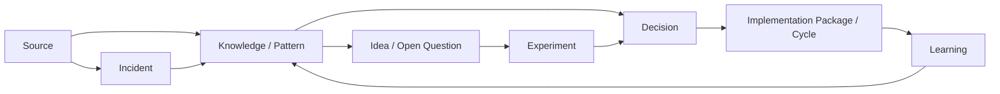

# DUTRA Builder Brain — Human Index

Generated from 97 records. Do not edit by hand; run `npm run og:brain:refresh`.

## Collections

| Type | Records |
|---|---:|
| anti_pattern | 12 |
| cycle | 9 |
| decision | 12 |
| experiment | 1 |
| idea | 3 |
| incident | 10 |
| knowledge | 9 |
| open_question | 5 |
| pattern | 17 |
| source | 19 |

## Active decisions

- **DEC-ARCH-001 — Evolve DUTRA OS instead of full rewrite** (active/high)
  Preserve current commercial frontend/intelligence and replace weak foundation incrementally.
- **DEC-ARCH-002 — Canonical relational truth with individual identity** (active/high)
  Architecture V1 selects Supabase Postgres as official commercial truth and Supabase Auth for individual PC/mobile identity, with Realtime deferred unless later evidence justifies it.
- **DEC-ARCH-003 — Keep vanilla JS frontend for V1** (active/high)
  No evidence currently justifies a React/Next rewrite; modularize incrementally when touched.
- **DEC-BRAIN-001 — Builder Brain V2 governance model** (active/high)
  Adopt proportional scope classes, semantic/referential validation, generated index/metrics, cycle closeout and license triage for Builder Brain.
- **DEC-SEC-00R-001 — Revision-authoritative synchronization baseline** (active/high)
  State writes require the current server revision; arbitrary force merge and client timestamp arbitration are not accepted by local or Cloudflare APIs.
- **DEC-XLSX-00R-001 — Isolate the legacy XLSX parser** (active/high)
  Remove vulnerable xlsx npm dependency and retain the vendored parser only inside a time- and size-bounded Web Worker until a compatible maintained replacement is validated.
- **DEC-SYNC-04R-001 — Human-reviewed revision conflicts with auth-safe outbox** (active/high)
  A revision conflict blocks automatic writes until a preserved local/remote comparison is reviewed; queued state persists without credentials and only an authenticated foreground session may perform the remote PUT.
- **DEC-MIG-05R-001 — Legacy reconciliation requires reviewed intent and reversible apply** (active/high)
  Legacy lead data may enter canonical Company/Contact only through dry-run classification, explicit user selection, checkpoint, revalidation against current state and controlled apply; weak/ambiguous matches never become canonical truth automatically.
- **DEC-HOST-06R-001 — HTTPS hosting is a protected preview, not a persistence architecture shortcut** (active/high)
  Expose the current DUTRA OS over HTTPS only through a protected hosted entrypoint with strong access token, healthcheck and persistent volume support; do not reinterpret the transition JSON state as the final canonical database or bypass the planned Supabase validation.
- **DEC-LEADS-OG18-001 — Keep conversation state, pipeline status and source as separate lead dimensions** (active/high)
  Smart lists are projections of one state.leads base. Conversation state, commercial pipeline status, source/list and priority remain independent fields; deterministic scoring may order work but never changes commercial truth automatically.
- **DEC-CIC01-001 — One deterministic score and shared commercial contracts** (active/high)
  All prioritization surfaces must delegate to the same deterministic score contract, and all next-action flows must use the same central mutation/normalization contracts instead of reimplementing weights, fallbacks or context rules per UI.
- **DEC-INTEL-COMPILER-001 — Extend Builder Brain as the DUTRA operational knowledge layer** (active/high)
  The existing Builder Brain remains the canonical durable evidence/decision layer; domain Skills stay thin and route to scoped context, stable domain guidance lives in existing knowledge/docs, dynamic account facts stay in CRM/runtime, and material bugs enter an incident collection with regression linkage.

## Open questions

- **OQ-PKG02-001 — Package 02 operational auth bootstrap details** (open/medium)
  Exact bootstrap/session/organization-membership implementation details must be confirmed against the chosen Supabase project/environment before enabling auth paths.
- **OQ-OG-TECH-001 — Which OG documents certify the current technical mappings** (open/high)
  Current code contains operational support/equalizer/vehicle mappings, but the exact validated OG source set that certifies each mapping must be attached/indexed before those mappings can be promoted to Confirmada OG outside implementation behavior.
- **OQ-INTEL-KCC-001 — Promote compiled domain knowledge into runtime Knowledge Command Center after review** (open/medium)
  The new agent-facing Skills/playbooks/context are available to repository agents immediately, while live Sales Brain/KCC uses its private imported knowledge index; decide which reviewed stable domain records should be ingested into that runtime index without importing volatile CRM facts or unvalidated OG claims.

## Open / active incidents

- **INC-XLSX-REPAIR-001 — Excel repaired generated workbook structures** (active/medium)
  A historical generated workbook opened with Excel recovery that removed an AutoFilter/table and a worksheet formula; the exact original serialization defect is not conclusively proven by recovered evidence.

## Recent resolved incidents

- **INC-EXEC-ENV-001 — Structural convergence blocked by missing checkout and unreachable proxy** (resolved/high)
  Structural work must prove its execution route before repository-local implementation. Local Git transport, GitHub provider access and hosted runtime access are separate capabilities; a failure in one must trigger classified fallback rather than repeated retries or false project conclusions.
- **INC-SUPABASE-DRIFT-001 — Supabase remote schema and Edge Functions exceed versioned repository state** (resolved/high)
  The live Supabase backend is now reconstructable from reviewed Git evidence: the exact 25 recorded migrations, all 13 deployed Edge Function sources, and a catalog-derived bootstrap supplement for eight CRM tables that had existed outside recorded migration history.
- **INC-V3-BLACK-001 — Historical V3 black screen and delayed first paint** (resolved/medium)
  The earlier V3 preview could render a black screen or delay the shell; the durable lesson is that the primary interface must render before optional/heavy modules.
- **INC-TECH-DATA-LOAD-001 — Historical technical configurator returned zero OG configurations** (resolved/medium)
  A technical configurator showed zero configurations when its OG data dependency had not been loaded before initialization.
- **INC-METRIC-CLOSE-001 — Historical close rate reached 48400 percent** (resolved/medium)
  A historical close-rate calculation mixed sales from a broad CRM population with proposals from a narrower prospecting population, producing an impossible 48400 percent result.
- **INC-PROSPECT-LIST-001 — Historical prospecting showed zero lists despite usable CRM views** (resolved/medium)
  Prospecting became operationally empty when lists were treated as an isolated module instead of projections/collections over the CRM base.
- **INC-SYNC-CONFLICT-001 — Silent revision conflict could overwrite local or remote work** (resolved/high)
  Revision conflicts require preserved local/remote state and explicit review; silent merge/resend is prohibited.
- **INC-CALLINT-AUDIO-001 — Call Intelligence real validation exposed audio and metric contract defects** (resolved/high)
  Real Call Intelligence validation required signed audio uploads to use raw binary, truck quantities to be recognized correctly, duplicate objection inflation to be prevented and synthetic TEST sessions to be excluded from production dashboards.

## Candidate / planned ideas

- **IDEA-BRAIN-001 — Research intake center for external references** (candidate/high)
  Provide a structured intake that accepts repo/article/paper/competitor/conversation sources and produces source cards, patterns, ideas and open questions without automatically changing product scope.
- **IDEA-BRAIN-002 — Idea promotion by repeated evidence/friction** (candidate/high)
  Track recurrence and evidence so repeated real friction promotes an idea while speculative novelty remains backlog.
- **IDEA-PRODUCT-001 — Company 360 as canonical commercial context surface** (planned/high)
  As Company/Contact become canonical, expose a fast Company 360 view with decision-maker, next action, timeline and quick actions.

## Validated / active patterns

- **PAT-REF-001 — Reference systems are pattern mines, not blueprints** (validated/high)
  Reverse engineer an external system by problem/capability, extract transferable patterns and complexity, then run a gap analysis before architecture decisions.
- **PAT-DATA-001 — One entity, one identity, multiple views** (active/high)
  CRM, prospecting, map, agenda, reports and AI should operate on canonical entities rather than maintain parallel copies.
- **PAT-AI-001 — AI over structured truth** (active/high)
  AI should consume selective structured context and propose actions; important writes pass through controlled domain operations and review rather than treating AI as the database.
- **PAT-DELIVERY-001 — Strangler migration with reversible vertical slices** (active/high)
  Replace legacy behavior incrementally with adapters, reconciliation, feature flags and rollback windows instead of a big-bang rewrite.
- **PAT-DELIVERY-002 — Professional gates may block release** (validated/high)
  Environment or test limitations should block/label a release rather than be hidden or reported as success.
- **PAT-UX-001 — Foundation plus visible user value** (active/high)
  Whenever safe, infrastructure packages should unlock a perceptible workflow improvement; UX polish should evolve with domain migration rather than as an isolated redesign.
- **PAT-BRAIN-001 — Proportional ceremony by risk** (active/high)
  Use MICRO, STANDARD and STRUCTURAL paths so low-risk work stays fast while structural work receives evidence/architecture/safety discipline.
- **PAT-BRAIN-002 — Machine store + generated human index** (active/high)
  Keep JSONL canonical for versioning/parsing while generating a readable index and metrics for human retrieval/adoption.
- **PAT-SYNC-001 — Durable outbox with foreground-auth handoff** (validated/high)
  Persist retryable state and recovery metadata without credentials, let background infrastructure signal pending work, and perform authenticated delivery in the foreground where session credentials already exist.
- **PAT-MIG-001 — Dry-run, approve, revalidate, apply, rollback selectively** (validated/high)
  For brownfield canonicalization, classify without mutation, require explicit approval, re-check candidates at apply time, checkpoint first and reverse only affected entities while blocking rollback if later work depends on them.
- **PAT-HOST-001 — Provider-safe preview entrypoint** (validated/high)
  For a brownfield app that was local-only, add a dedicated hosted entrypoint that validates secrets before boot, binds provider PORT on 0.0.0.0, exposes a minimal unauthenticated healthcheck, routes persistent state to the provider volume and keeps production architecture boundaries explicit.
- **PAT-CIC01-001 — Context-aware deterministic decision contract** (validated/high)
  Centralize deterministic decisions in one contract, make dependent context invalidation explicit, include relevant business context in cache keys, and exercise every alternate UI path through the same contract in regression tests.
- **PAT-CONTEXT-ROUTING-001 — Route minimal context by task** (active/high)
  Load a small core context plus the domain Skill/docs needed for the task instead of injecting the full project history into every agent invocation.
- **PAT-BUG-LEARNING-001 — Bug to prevention to regression** (active/high)
  A material bug is not fully closed when behavior is patched; capture symptom and root cause, derive a prevention rule, attach a regression test and preserve provenance in the incident store.
- **PAT-SALES-STAGE-001 — Stage-aware commercial guidance** (active/high)
  Select commercial objective, questions and next step from current relationship/pipeline context: gatekeeper seeks access, decision maker gets diagnosis, proposal gets blocker analysis, follow-up resumes commitments and customer/post-sale starts with experience.
- **PAT-TECH-VALIDATION-001 — Technical uncertainty becomes a validation state** (active/high)
  When technical evidence is insufficient or conflicting, preserve uncertainty as Precisa validar/Não determinada and route to manual validation rather than filling the gap from plausibility, code history or model inference.
- **PAT-AUTOMATION-ESCAPE-001 — Automation with manual escape** (active/high)
  Automation should accelerate common work while preserving review, edit, replace, add, remove, note and validate paths for real exceptions.

## Recent sources

- **SRC-CONVERGENCE-ENV-20261004-001 — CONVERGENCE-01 Stage 0 execution environment preflight** (validated/high)
  CONVERGENCE-01 Stage 0 documented the failed initial cloud workspace with no usable checkout and unreachable proxy transport, followed by successful recovery in a repository-attached workspace with a valid Git checkout.
- **SRC-INTEL-RECOVERY-001 — DUTRA OS recovered conversation knowledge audit** (validated/medium)
  Recovered master conversation and technical handoff preserve historical decisions, bugs, playbooks and prior V3 migration context; they are evidence inputs but do not override current tested main or validated OG sources.
- **SRC-INTEL-MAIN-001 — Live GitHub main audit for Intelligence Compiler** (validated/high)
  Live repository audit established GitHub main at f4c2b3c68d747b6477410ffff50521d8788f8d62 as the current canonical code line and identified the existing Builder Brain, context manifests, knowledge services, current tests and newer Call Intelligence/Whisper implementation.
- **SRC-CALLINT-20261001-001 — Call Intelligence and local Whisper production hardening commits** (implemented/high)
  Main commit chain 39be4d18 → 445ac095 → d631ef29 → af5469eb → f4c2b3c6 hardened signed audio upload, fact extraction, production metric hygiene and the local faster-whisper fallback, then added an opt-in production end-to-end self-test.
- **SRC-TECH-HANDOFF-20261001-001 — Live GitHub/Railway/Supabase technical recovery audit** (validated/high)
  Live audit verified GitHub main and Railway production alignment before the Intelligence Compiler merge, persistent Railway volume /data, PWA cache v67, an active hybrid Supabase/Postgres backend, and a reproducibility gap: the remote Supabase project had 25 applied migrations and 13 active Edge Functions while the repository versioned only 4 migration files and 2 Edge Function sources.
- **SRC-INTEL-CLOSEOUT-001 — DUTRA Intelligence Compiler V1 PR and CI closeout** (implemented/high)
  PR #104 merged the Intelligence Compiler V1 to main as commit 72354a1f04d6fdd5584fe876ec4b09bb050a312a after PR workflows Package 00R CI #404, Sales Execution P0 #24 and Call Intelligence V1 #22 passed; main Package 00R CI #405 also passed after merge.
- **SRC-PKG04R-001 — Package 04R durable sync bridge and conflict review** (implemented/high)
  Package 04R replaces silent conflict merge/resend with durable conflict recovery, explicit human review, authenticated foreground outbox delivery and serialized revision-aware writes while preserving local-first compatibility.
- **SRC-PKG05R-001 — Package 05R controlled legacy reconciliation** (implemented/high)
  Package 05R merged through PR #9 after final CI, establishing a dry-run-first, human-approved and checkpointed path from legacy lead identity to canonical Company/Contact, with stale-plan revalidation and selective rollback safeguards.
- **SRC-PKG06R-001 — Package 06R secure HTTPS preview runtime** (implemented/high)
  Package 06R published a protected Railway HTTPS preview and verified the live service, domain, healthcheck and deployed main commit while explicitly retaining filesystem persistence as non-canonical preview storage.
- **SRC-OG18-001 — OG-18 smart Leads & Transcrição implementation** (implemented/high)
  OG-18 adds a deterministic smart lead queue over the existing state.leads source of truth, with separate conversation state, commercial status, origin and priority dimensions plus responsive filtering and client-sheet editing.

## Retrieval workflow

1. Start here.
2. Use `CONTEXT_ROUTER.md` to select the smallest relevant domain context.
3. Search by ID/tag in the relevant JSONL collection.
4. Follow `source_ids`, `derived_from`, and `supersedes` for provenance.
5. Load only the records needed for the task.

## Relationship model

```mermaid
flowchart LR
  S[Source] --> K[Knowledge / Pattern]
  S --> N[Incident]
  N --> K
  K --> I[Idea / Open Question]
  K --> D[Decision]
  I --> E[Experiment]
  D --> P[Implementation Package / Cycle]
  E --> D
  P --> L[Learning]
  L --> K
```
