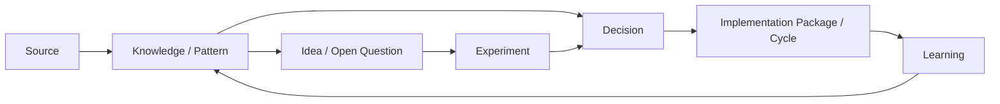

# DUTRA Builder Brain — Human Index

Generated from 60 records. Do not edit by hand; run `npm run og:brain:refresh`.

## Collections

| Type | Records |
|---|---:|
| anti_pattern | 6 |
| cycle | 8 |
| decision | 11 |
| experiment | 1 |
| idea | 3 |
| knowledge | 4 |
| open_question | 2 |
| pattern | 12 |
| source | 13 |

## Active decisions

- **DEC-ARCH-001 — Evolve DUTRA OS instead of full rewrite** (active/high)
  Preserve current commercial frontend/intelligence and replace weak foundation incrementally.
- **DEC-ARCH-002 — Canonical relational truth with individual identity** (active/high)
  Architecture V1 selects Supabase Postgres as official commercial truth and Supabase Auth for individual PC/mobile identity, with Realtime deferred unless later evidence justifies it.
- **DEC-ARCH-003 — Keep vanilla JS frontend for V1** (active/high)
  No evidence currently justifies a React/Next rewrite; modularize incrementally when touched.
- **DEC-BRAIN-001 — Builder Brain V2 governance model** (active/high)
  Adopt proportional scope classes, semantic/referential validation, generated index/metrics, cycle closeout and license triage for Builder Brain.
- **DEC-SEC-00R-001 — Revision-authoritative synchronization baseline** (active/high)
  State writes require the current server revision; arbitrary force merge and client timestamp arbitration are not accepted by local or Cloudflare APIs.
- **DEC-XLSX-00R-001 — Isolate the legacy XLSX parser** (active/high)
  Remove vulnerable xlsx npm dependency and retain the vendored parser only inside a time- and size-bounded Web Worker until a compatible maintained replacement is validated.
- **DEC-SYNC-04R-001 — Human-reviewed revision conflicts with auth-safe outbox** (active/high)
  A revision conflict blocks automatic writes until a preserved local/remote comparison is reviewed; queued state persists without credentials and only an authenticated foreground session may perform the remote PUT.
- **DEC-MIG-05R-001 — Legacy reconciliation requires reviewed intent and reversible apply** (active/high)
  Legacy lead data may enter canonical Company/Contact only through dry-run classification, explicit user selection, checkpoint, revalidation against current state and controlled apply; weak/ambiguous matches never become canonical truth automatically.
- **DEC-HOST-06R-001 — HTTPS hosting is a protected preview, not a persistence architecture shortcut** (active/high)
  Expose the current DUTRA OS over HTTPS only through a protected hosted entrypoint with strong access token, healthcheck and persistent volume support; do not reinterpret the transition JSON state as the final canonical database or bypass the planned Supabase validation.
- **DEC-LEADS-OG18-001 — Keep conversation state, pipeline status and source as separate lead dimensions** (active/high)
  Smart lists are projections of one state.leads base. Conversation state, commercial pipeline status, source/list and priority remain independent fields; deterministic scoring may order work but never changes commercial truth automatically.
- **DEC-CIC01-001 — One deterministic score and shared commercial contracts** (active/high)
  All prioritization surfaces must delegate to the same deterministic score contract, and all next-action flows must use the same central mutation/normalization contracts instead of reimplementing weights, fallbacks or context rules per UI.

## Open questions

- **OQ-PKG02-001 — Package 02 operational auth bootstrap details** (open/medium)
  Exact bootstrap/session/organization-membership implementation details must be confirmed against the chosen Supabase project/environment before enabling auth paths.

## Candidate / planned ideas

- **IDEA-BRAIN-001 — Research intake center for external references** (candidate/high)
  Provide a structured intake that accepts repo/article/paper/competitor/conversation sources and produces source cards, patterns, ideas and open questions without automatically changing product scope.
- **IDEA-BRAIN-002 — Idea promotion by repeated evidence/friction** (candidate/high)
  Track recurrence and evidence so repeated real friction promotes an idea while speculative novelty remains backlog.
- **IDEA-PRODUCT-001 — Company 360 as canonical commercial context surface** (planned/high)
  As Company/Contact become canonical, expose a fast Company 360 view with decision-maker, next action, timeline and quick actions.

## Validated / active patterns

- **PAT-REF-001 — Reference systems are pattern mines, not blueprints** (validated/high)
  Reverse engineer an external system by problem/capability, extract transferable patterns and complexity, then run a gap analysis before architecture decisions.
- **PAT-DATA-001 — One entity, one identity, multiple views** (active/high)
  CRM, prospecting, map, agenda, reports and AI should operate on canonical entities rather than maintain parallel copies.
- **PAT-AI-001 — AI over structured truth** (active/high)
  AI should consume selective structured context and propose actions; important writes pass through controlled domain operations and review rather than treating AI as the database.
- **PAT-DELIVERY-001 — Strangler migration with reversible vertical slices** (active/high)
  Replace legacy behavior incrementally with adapters, reconciliation, feature flags and rollback windows instead of a big-bang rewrite.
- **PAT-DELIVERY-002 — Professional gates may block release** (validated/high)
  Environment or test limitations should block/label a release rather than be hidden or reported as success.
- **PAT-UX-001 — Foundation plus visible user value** (active/high)
  Whenever safe, infrastructure packages should unlock a perceptible workflow improvement; UX polish should evolve with domain migration rather than as an isolated redesign.
- **PAT-BRAIN-001 — Proportional ceremony by risk** (active/high)
  Use MICRO, STANDARD and STRUCTURAL paths so low-risk work stays fast while structural work receives evidence/architecture/safety discipline.
- **PAT-BRAIN-002 — Machine store + generated human index** (active/high)
  Keep JSONL canonical for versioning/parsing while generating a readable index and metrics for human retrieval/adoption.
- **PAT-SYNC-001 — Durable outbox with foreground-auth handoff** (validated/high)
  Persist retryable state and recovery metadata without credentials, let background infrastructure signal pending work, and perform authenticated delivery in the foreground where session credentials already exist.
- **PAT-MIG-001 — Dry-run, approve, revalidate, apply, rollback selectively** (validated/high)
  For brownfield canonicalization, classify without mutation, require explicit approval, re-check candidates at apply time, checkpoint first and reverse only affected entities while blocking rollback if later work depends on them.
- **PAT-HOST-001 — Provider-safe preview entrypoint** (validated/high)
  For a brownfield app that was local-only, add a dedicated hosted entrypoint that validates secrets before boot, binds provider PORT on 0.0.0.0, exposes a minimal unauthenticated healthcheck, routes persistent state to the provider volume and keeps production architecture boundaries explicit.
- **PAT-CIC01-001 — Context-aware deterministic decision contract** (validated/high)
  Centralize deterministic decisions in one contract, make dependent context invalidation explicit, include relevant business context in cache keys, and exercise every alternate UI path through the same contract in regression tests.

## Recent sources

- **SRC-PKG04R-001 — Package 04R durable sync bridge and conflict review** (implemented/high)
  Package 04R replaces silent conflict merge/resend with durable conflict recovery, explicit human review, authenticated foreground outbox delivery and serialized revision-aware writes while preserving local-first compatibility.
- **SRC-PKG05R-001 — Package 05R controlled legacy reconciliation** (implemented/high)
  Package 05R merged through PR #9 after final CI, establishing a dry-run-first, human-approved and checkpointed path from legacy lead identity to canonical Company/Contact, with stale-plan revalidation and selective rollback safeguards.
- **SRC-PKG06R-001 — Package 06R secure HTTPS preview runtime** (implemented/high)
  Package 06R published a protected Railway HTTPS preview and verified the live service, domain, healthcheck and deployed main commit while explicitly retaining filesystem persistence as non-canonical preview storage.
- **SRC-OG18-001 — OG-18 smart Leads & Transcrição implementation** (implemented/high)
  OG-18 adds a deterministic smart lead queue over the existing state.leads source of truth, with separate conversation state, commercial status, origin and priority dimensions plus responsive filtering and client-sheet editing.
- **SRC-CIC01-001 — CIC-01 Next Best Action + Score Explicável closeout** (implemented/high)
  CIC-01 consolidated explainable prioritization and next-action context around shared deterministic contracts, then passed final audit before closeout on PR #23 without introducing a second score, queue or agenda.
- **SRC-DUTRA-AUDIT-001 — DUTRA OS technical audit** (validated/high)
  Audit of the actual DUTRA OS code/data paths used to establish current-state risks and assets before architecture work.
- **SRC-DESKCOMM-REV-001 — DeskcommCRM reverse engineering** (validated/high)
  Open-source CRM studied as an engineering reference; patterns were extracted together with limitations and NOT CONFIRMED areas rather than copied wholesale.
- **SRC-GAP-001 — DUTRA OS × DeskcommCRM gap analysis** (validated/high)
  Capability-by-capability comparison used to separate useful patterns from unnecessary complexity.
- **SRC-ARCH-V1-001 — DUTRA OS Architecture V1** (active/high)
  Approved architectural direction: evolve incrementally, use canonical relational truth and individual identity while preserving differentiated commercial UX/intelligence.
- **SRC-PLAN-001 — DUTRA OS Master Implementation Plan** (active/high)
  Turns Architecture V1 into small reversible packages across Foundation and Commercial Product tracks.

## Retrieval workflow

1. Start here.
2. Search by ID/tag in the relevant JSONL collection.
3. Follow `source_ids`, `derived_from`, and `supersedes` for provenance.
4. Load only the records needed for the task.

## Relationship model

```mermaid
flowchart LR
  S[Source] --> K[Knowledge / Pattern]
  K --> I[Idea / Open Question]
  K --> D[Decision]
  I --> E[Experiment]
  D --> P[Implementation Package / Cycle]
  E --> D
  P --> L[Learning]
  L --> K
```
