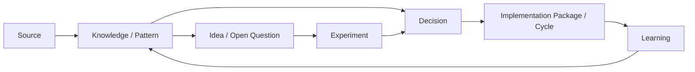

# DUTRA Builder Brain — Human Index

Generated from 88 records. Do not edit by hand; run `npm run og:brain:refresh`.

## Collections

| Type | Records |
|---|---:|
| anti_pattern | 11 |
| cycle | 10 |
| decision | 17 |
| experiment | 1 |
| idea | 3 |
| knowledge | 8 |
| open_question | 4 |
| pattern | 17 |
| source | 17 |

## Active decisions

- **DEC-ARCH-001 — Evolve DUTRA OS instead of full rewrite** (active/high)
  Preserve current commercial frontend/intelligence and replace weak foundation incrementally.
- **DEC-ARCH-002 — Canonical relational truth with individual identity** (active/high)
  Architecture V1 selects Supabase Postgres as official commercial truth and Supabase Auth for individual PC/mobile identity, with Realtime deferred unless later evidence justifies it.
- **DEC-ARCH-003 — Keep vanilla JS frontend for V1** (active/high)
  No evidence currently justifies a React/Next rewrite; modularize incrementally when touched.
- **DEC-BRAIN-001 — Builder Brain V2 governance model** (active/high)
  Adopt proportional scope classes, semantic/referential validation, generated index/metrics, cycle closeout and license triage for Builder Brain.
- **DEC-SEC-00R-001 — Revision-authoritative synchronization baseline** (active/high)
  State writes require the current server revision; arbitrary force merge and client timestamp arbitration are not accepted by local or Cloudflare APIs.
- **DEC-XLSX-00R-001 — Isolate the legacy XLSX parser** (active/high)
  Remove vulnerable xlsx npm dependency and retain the vendored parser only inside a time- and size-bounded Web Worker until a compatible maintained replacement is validated.
- **DEC-SYNC-04R-001 — Human-reviewed revision conflicts with auth-safe outbox** (active/high)
  A revision conflict blocks automatic writes until a preserved local/remote comparison is reviewed; queued state persists without credentials and only an authenticated foreground session may perform the remote PUT.
- **DEC-MIG-05R-001 — Legacy reconciliation requires reviewed intent and reversible apply** (active/high)
  Legacy lead data may enter canonical Company/Contact only through dry-run classification, explicit user selection, checkpoint, revalidation against current state and controlled apply; weak/ambiguous matches never become canonical truth automatically.
- **DEC-HOST-06R-001 — HTTPS hosting is a protected preview, not a persistence architecture shortcut** (active/high)
  Expose the current DUTRA OS over HTTPS only through a protected hosted entrypoint with strong access token, healthcheck and persistent volume support; do not reinterpret the transition JSON state as the final canonical database or bypass the planned Supabase validation.
- **DEC-LEADS-OG18-001 — Keep conversation state, pipeline status and source as separate lead dimensions** (active/high)
  Smart lists are projections of one state.leads base. Conversation state, commercial pipeline status, source/list and priority remain independent fields; deterministic scoring may order work but never changes commercial truth automatically.
- **DEC-CIC01-001 — One deterministic score and shared commercial contracts** (active/high)
  All prioritization surfaces must delegate to the same deterministic score contract, and all next-action flows must use the same central mutation/normalization contracts instead of reimplementing weights, fallbacks or context rules per UI.
- **DEC-V3-SHELL-001 — V3 is the single user experience during reintegration** (active/high)
  The V3 shell is the user-facing experience; legacy screens/engines may run internally during migration but must not require the seller to alternate between independent systems.
- **DEC-TECH-SINGLE-001 — One technical engine with VALIDAR/manual fallback** (active/high)
  All application consumers should converge on one deterministic technical engine; uncovered/ambiguous combinations return VALIDAR and manual override remains available instead of inventing a support mapping.
- **DEC-AI-REVIEW-001 — AI suggestions require review before becoming CRM truth** (active/high)
  AI research and call analysis may propose structured updates, but inferred fields, notes and next actions require explicit review before persistence as customer truth.
- **DEC-INT-COMPILER-001 — Compile history into existing Second Brain plus routed Skills** (active/high)
  Conversation history is not a runtime dependency: durable knowledge is classified into the existing Second Brain and domain files, exposed through compact Skills and context routing, while volatile account data stays in CRM storage.
- **DEC-PROMPT-ARCH-001 — Prompt Architect owns intent-to-mission compilation** (active/high)
  Use a dedicated Prompt Architect to convert human intent into scoped L0-L3 execution missions; Builder Brain remains decision/learning governance, Context Router remains retrieval authority, and SubagentPromptBuilder remains AIOX static task/agent packaging.
- **DEC-METRIC-UNIVERSE-001 — Conversion metrics use consistent attribution populations** (active/high)
  A conversion rate may only combine numerator and denominator from the same attributed population/filter; close rate must not be inflated by unrelated historical CRM sales.

## Open questions

- **OQ-PKG02-001 — Package 02 operational auth bootstrap details** (open/medium)
  Exact bootstrap/session/organization-membership implementation details must be confirmed against the chosen Supabase project/environment before enabling auth paths.
- **OQ-TECH-UNIFICATION-001 — When is the V3 technical engine fully single-source?** (open/high)
  The shared technical engine and parity tests exist, but fallback/duplicated decision paths must be inventoried and removed before single-source status can be declared.
- **OQ-V3-OFFLINE-ACCEPT-001 — Manual offline/reconnect acceptance on real authenticated browser** (open/high)
  Automated sync/idempotency gates pass, but the real-browser flow of edit offline, close/reopen, reconnect, replay and reload still requires manual acceptance evidence.

## Candidate / planned ideas

- **IDEA-BRAIN-001 — Research intake center for external references** (candidate/high)
  Provide a structured intake that accepts repo/article/paper/competitor/conversation sources and produces source cards, patterns, ideas and open questions without automatically changing product scope.
- **IDEA-BRAIN-002 — Idea promotion by repeated evidence/friction** (candidate/high)
  Track recurrence and evidence so repeated real friction promotes an idea while speculative novelty remains backlog.
- **IDEA-PRODUCT-001 — Company 360 as canonical commercial context surface** (planned/high)
  As Company/Contact become canonical, expose a fast Company 360 view with decision-maker, next action, timeline and quick actions.

## Validated / active patterns

- **PAT-REF-001 — Reference systems are pattern mines, not blueprints** (validated/high)
  Reverse engineer an external system by problem/capability, extract transferable patterns and complexity, then run a gap analysis before architecture decisions.
- **PAT-DATA-001 — One entity, one identity, multiple views** (active/high)
  CRM, prospecting, map, agenda, reports and AI should operate on canonical entities rather than maintain parallel copies.
- **PAT-AI-001 — AI over structured truth** (active/high)
  AI should consume selective structured context and propose actions; important writes pass through controlled domain operations and review rather than treating AI as the database.
- **PAT-DELIVERY-001 — Strangler migration with reversible vertical slices** (active/high)
  Replace legacy behavior incrementally with adapters, reconciliation, feature flags and rollback windows instead of a big-bang rewrite.
- **PAT-DELIVERY-002 — Professional gates may block release** (validated/high)
  Environment or test limitations should block/label a release rather than be hidden or reported as success.
- **PAT-UX-001 — Foundation plus visible user value** (active/high)
  Whenever safe, infrastructure packages should unlock a perceptible workflow improvement; UX polish should evolve with domain migration rather than as an isolated redesign.
- **PAT-BRAIN-001 — Proportional ceremony by risk** (active/high)
  Use MICRO, STANDARD and STRUCTURAL paths so low-risk work stays fast while structural work receives evidence/architecture/safety discipline.
- **PAT-BRAIN-002 — Machine store + generated human index** (active/high)
  Keep JSONL canonical for versioning/parsing while generating a readable index and metrics for human retrieval/adoption.
- **PAT-SYNC-001 — Durable outbox with foreground-auth handoff** (validated/high)
  Persist retryable state and recovery metadata without credentials, let background infrastructure signal pending work, and perform authenticated delivery in the foreground where session credentials already exist.
- **PAT-MIG-001 — Dry-run, approve, revalidate, apply, rollback selectively** (validated/high)
  For brownfield canonicalization, classify without mutation, require explicit approval, re-check candidates at apply time, checkpoint first and reverse only affected entities while blocking rollback if later work depends on them.
- **PAT-HOST-001 — Provider-safe preview entrypoint** (validated/high)
  For a brownfield app that was local-only, add a dedicated hosted entrypoint that validates secrets before boot, binds provider PORT on 0.0.0.0, exposes a minimal unauthenticated healthcheck, routes persistent state to the provider volume and keeps production architecture boundaries explicit.
- **PAT-CIC01-001 — Context-aware deterministic decision contract** (validated/high)
  Centralize deterministic decisions in one contract, make dependent context invalidation explicit, include relevant business context in cache keys, and exercise every alternate UI path through the same contract in regression tests.
- **PAT-AUTO-ESCAPE-001 — Automation with manual escape** (validated/high)
  Use automation to produce a strong default, then preserve edit, override, add, remove, observe and validate paths whenever real commercial/technical exceptions exist.
- **PAT-METRIC-POPULATION-001 — Metric numerator and denominator share one population** (validated/high)
  Conversion metrics must derive numerator and denominator from compatible filters, attribution and time/population scope; historical totals cannot be divided by current-session denominators.
- **PAT-CONTEXT-ROUTER-001 — Skill to context to source routing** (active/high)
  Keep Skills procedural and compact, route each task to a bounded context set, and retain deeper evidence in canonical source files instead of copying the master context into every prompt.
- **PAT-PROMPT-MINCTX-001 — Mission prompts use minimal decision-changing context** (active/high)
  Execution prompts should reference bounded required context, conditional context and explicit do-not-load areas, scaling prompt depth with risk instead of copying the whole project history into each delegation.
- **PAT-V3-INTERNAL-LEGACY-001 — New shell over extracted brownfield engines** (validated/high)
  When a new UX is approved but the legacy system owns mature domain logic, keep one user-facing shell and progressively extract/reuse legacy engines behind it until transitional bridges can be removed.

## Recent sources

- **SRC-CHAT-RECOVERY-20261001 — DUTRA OS master conversation recovery audit** (validated/high)
  User-reviewed recovery audit consolidating the long-running DUTRA OS conversation into decisions, implemented work, failures, commercial context, technical mappings and pending work before chat archival.
- **SRC-TECH-HANDOFF-20261001 — DUTRA OS technical handoff 2026-10-01** (validated/high)
  Technical handoff reconciled the recovery report with live GitHub/Railway evidence, distinguishing core main from the V3 shell and identifying current architecture, migrations, runtime state, bugs and technical debt.
- **SRC-INT-COMPILER-20261001 — DUTRA Intelligence Compiler specification** (active/high)
  User specification requiring project history to be compiled into the existing Second Brain, Skills, context routing, playbooks, incident prevention, prompts and tests instead of being left as chat-only documentation.
- **SRC-PROMPT-ARCH-20261001 — DUTRA Prompt Architect specification and implementation** (implemented/high)
  User-directed implementation adds a dedicated intent-to-mission layer that classifies prompt depth, routes minimal context and defines execution/acceptance contracts without duplicating Builder Brain or AIOX task packaging.
- **SRC-PKG04R-001 — Package 04R durable sync bridge and conflict review** (implemented/high)
  Package 04R replaces silent conflict merge/resend with durable conflict recovery, explicit human review, authenticated foreground outbox delivery and serialized revision-aware writes while preserving local-first compatibility.
- **SRC-PKG05R-001 — Package 05R controlled legacy reconciliation** (implemented/high)
  Package 05R merged through PR #9 after final CI, establishing a dry-run-first, human-approved and checkpointed path from legacy lead identity to canonical Company/Contact, with stale-plan revalidation and selective rollback safeguards.
- **SRC-PKG06R-001 — Package 06R secure HTTPS preview runtime** (implemented/high)
  Package 06R published a protected Railway HTTPS preview and verified the live service, domain, healthcheck and deployed main commit while explicitly retaining filesystem persistence as non-canonical preview storage.
- **SRC-OG18-001 — OG-18 smart Leads & Transcrição implementation** (implemented/high)
  OG-18 adds a deterministic smart lead queue over the existing state.leads source of truth, with separate conversation state, commercial status, origin and priority dimensions plus responsive filtering and client-sheet editing.
- **SRC-CIC01-001 — CIC-01 Next Best Action + Score Explicável closeout** (implemented/high)
  CIC-01 consolidated explainable prioritization and next-action context around shared deterministic contracts, then passed final audit before closeout on PR #23 without introducing a second score, queue or agenda.
- **SRC-DUTRA-AUDIT-001 — DUTRA OS technical audit** (validated/high)
  Audit of the actual DUTRA OS code/data paths used to establish current-state risks and assets before architecture work.

## Retrieval workflow

1. Start here.
2. Search by ID/tag in the relevant JSONL collection.
3. Follow `source_ids`, `derived_from`, and `supersedes` for provenance.
4. Load only the records needed for the task.

## Relationship model

```mermaid
flowchart LR
  S[Source] --> K[Knowledge / Pattern]
  K --> I[Idea / Open Question]
  K --> D[Decision]
  I --> E[Experiment]
  D --> P[Implementation Package / Cycle]
  E --> D
  P --> L[Learning]
  L --> K
```
